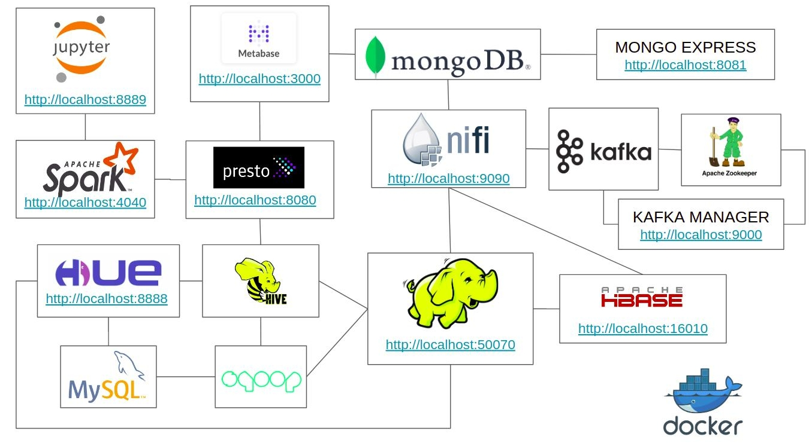

# BIG DATA ECOSYSTEM COM DOCKER

Ambiente para estudo dos principais frameworks big data em docker.
  Esse setup vai criar dockers com os frameworks HDFS, HBase, Hive, Presto, Spark, Jupyter, Hue, Mongodb, Metabase, Nifi, kafka, Mysql e Zookeeper com a seguinte arquitetura:
   

## SOFTWARES NECESSÁRIOS
#### Para o uso do ambiente vamos utilizar git e docker
   * Instalação do Docker no [Windows ou Mac](https://docs.docker.com/toolbox/overview/) ou no [Linux](https://docs.docker.com/install/linux/docker-ce/ubuntu/)
   *  [Instalação do git](https://git-scm.com/book/pt-br/v2/Come%C3%A7ando-Instalando-o-Git)

## SETUP

#### Criação do diretório docker
   *  No Windows:
      *  Criar na raiz do seu drive o diretório docker
         ex: D:\docker
          
   * No Linux:
      * Criar o diretório na home do usuário
        ex: /home/user/docker

#### Baixar o repo dentro diretório docker
          git clone https://github.com/fabiogjardim/bigdata_docker.git

### No diretório bigdata_docker vai existir os seguintes objetos

          aux/
          data/
          docker-compose_windows.yml
          docker-compose.yml
          .git/
          jars/
          README.md
          virtualbox_config.bat

   *  No Windows:
      *renomear o arquivo docker-compose.yml para docker-compose_linux.yml*
                  
          mv docker-compose.yml docker-compose_linux.yml
        
      *renomear o arquivo docker-compose_windows.yml para docker-compose.yml*
       
          mv docker-compose_windows.yml docker-compose.yml
      *Executar o arquivo virtualbox_config.bat*
      
         **O arquvo bat irá criar a VM default com disco de 100GB, memória de 8GB, drive do repo compartilhado e todas as portas necessárias mapeadas  

## INICIANDO O AMBIENTE

#### No diretorio bigdata_docker, executar o docker-compose
          docker-compose up -d
        
### Verificar imagens e containers
 
         docker image ls
         docker container ls

### Parar todos containers
         docker stop $(docker ps -a -q)
         
### Remover todos containers
         docker rm $(docker ps -a -q)
         
### Dados do containers
         docker container inspect [nome do container]

## Acesso WebUI dos Frameworks
 
* HDFS *http://localhost:50070*
* Presto *http://localhost:8080*
* Hbase *http://localhost:16010/master-status*
* Mongo Express *http://localhost:8081*
* Kafka Manager *http://localhost:9000*
* Metabase *http://localhost:3000*
* Nifi *http://localhost:9090*
* Jupyter Spark *http://localhost:8889*
* Hue *http://localhost:8888*
* Spark *http://localhost:4040*

## Acesso por shell

   ##### HDFS

          docker exec -it datanode bash

   ##### HBase

          docker exec -it hbase-master bash

   ##### Sqoop

          docker exec -it datanode bash
        
   ##### Kafka

          docker exec -it kafka bash

## Acesso JDBC

   ##### MySQL
          jdbc:mysql://database/employees

   ##### Hive

          jdbc:hive2://hive-server:10000/default

   ##### Presto

          jdbc:presto://presto:8080/hive/default
 
## Imagens     

[Docker Hub](https://hub.docker.com/u/fjardim)

## Documentação Oficial

* https://zookeeper.apache.org/
* https://kafka.apache.org/
* https://nifi.apache.org/
* https://prestodb.io/
* https://spark.apache.org/
* https://www.mongodb.com/
* https://www.metabase.com/
* https://jupyter.org/
* https://hbase.apache.org/
* https://sqoop.apache.org/
* https://hadoop.apache.org/
* https://hive.apache.org/
* https://gethue.com/
* https://github.com/yahoo/CMAK
* https://www.docker.com/
