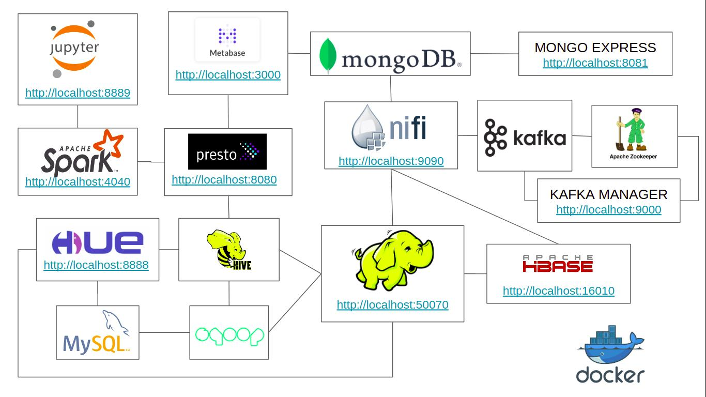
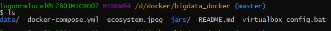
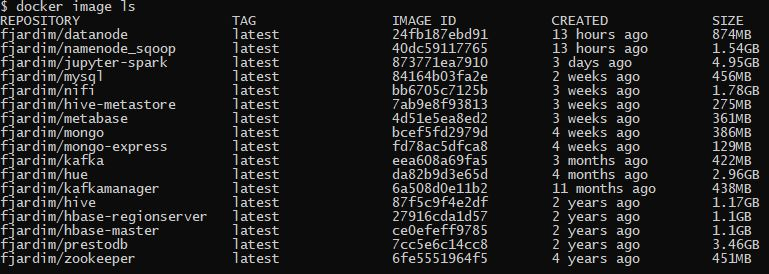
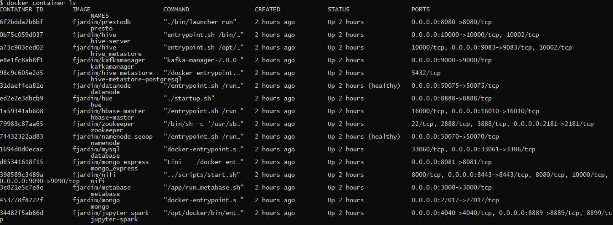

# BIG DATA ECOSYSTEM COM DOCKER

Ambiente para estudo dos principais frameworks big data em docker.
  Esse setup vai criar dockers com os frameworks HDFS, HBase, Hive, Presto, Spark, Jupyter, Hue, Mongodb, Metabase, Nifi, kafka, Mysql e Zookeeper com a seguinte arquitetura:
   

## SOFTWARES NECESSÁRIOS
#### Para a criação e uso do ambiente vamos utilizar o git e o Docker 
   * Instalação do Docker Desktop no Windows [Docker Desktop](https://hub.docker.com/editions/community/docker-ce-desktop-windows) ou o docker no [Linux](https://docs.docker.com/install/linux/docker-ce/ubuntu/)
   *  [Instalação do git](https://git-scm.com/book/pt-br/v2/Come%C3%A7ando-Instalando-o-Git)
   
## SETUP
*OBS: Esse passo deve ser realizado apena uma vez. Após o ambiente criado, utilizar o docker-compose para iniciar os containers como mostrado no tópico INICIANDO O AMBIENTE*

#### Criação do diretório docker:
*OBS: Criar um diretório chamado docker*

   *  Sugestão no Windows:
      *  Criar na raiz do seu drive o diretório docker
         ex: C:\docker
          
   * Sugestão no Linux:
      * Criar o diretório na home do usuário
        ex: /home/user/docker

#### Em um terminal/DOS, dentro diretório docker, realizar o clone do projeto no github
          git clone https://github.com/fabiogjardim/bigdata_docker.git

#### No diretório bigdata_docker vai existir os seguintes objetos

   
## INICIANDO O AMBIENTE
   
  *No Windows abrir PowerShell, do Linux um terminal*

### No terminal, no diretorio bigdata_docker, executar o docker-compose
          docker-compose up -d        

### Verificar imagens e containers
 
         docker image ls

         docker container ls

## SOLUCIONANDO PROBLEMAS 
   
  *No Windows abrir o Docker Quickstart Terminal*

### Parar um containers
         docker stop [nome do container]      

### Parar todos containers
         docker stop $(docker ps -a -q)
  
### Remover um container
         docker rm [nome do container]

### Remover todos containers
         docker rm $(docker ps -a -q)         

### Dados do containers
         docker container inspect [nome do container]

### Iniciar um container
         docker-compose up -d [nome do container]

### Iniciar todos os containers
         docker-compose up -d 

### Acessar log do container
         docker container logs [nome do container] 

## Acesso WebUI dos Frameworks
 
* HDFS *http://localhost:50070*
* Presto *http://localhost:8080*
* Hbase *http://localhost:16010/master-status*
* Mongo Express *http://localhost:8081*
* Kafka Manager *http://localhost:9000*
* Metabase *http://localhost:3000*
* Nifi *http://localhost:9090*
* Jupyter Spark *http://localhost:8889*
* Hue *http://localhost:8888*
* Spark *http://localhost:4040*

## Acesso por shell

   ##### HDFS

          docker exec -it datanode bash

   ##### HBase

          docker exec -it hbase-master bash

   ##### Sqoop

          docker exec -it datanode bash
        
   ##### Kafka

          docker exec -it kafka bash

## Acesso JDBC

   ##### MySQL
          jdbc:mysql://database/employees

   ##### Hive

          jdbc:hive2://hive-server:10000/default

   ##### Presto

          jdbc:presto://presto:8080/hive/default

## Usuários e senhas

   ##### Hue
    Usuário: admin
    Senha: admin

   ##### Metabase
    Usuário: bigdata@class.com
    Senha: bigdata123 

   ##### MySQL
    Usuário: root
    Senha: secret
   
   ##### MongoDB
    Usuário: root
    Senha: root
    Authentication Database: admin

## Imagens   

[Docker Hub](https://hub.docker.com/u/fjardim)

## Documentação Oficial

* https://zookeeper.apache.org/
* https://kafka.apache.org/
* https://nifi.apache.org/
* https://prestodb.io/
* https://spark.apache.org/
* https://www.mongodb.com/
* https://www.metabase.com/
* https://jupyter.org/
* https://hbase.apache.org/
* https://sqoop.apache.org/
* https://hadoop.apache.org/
* https://hive.apache.org/
* https://gethue.com/
* https://github.com/yahoo/CMAK
* https://www.docker.com/
